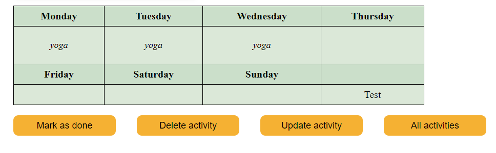

## Frontend-CI-CD-pipeline-Grupp5

<br>



### **Kurs**: Paketering, leverans och uppföljning

### Grupp 5: 

* Yulia Gutorova
* Una Paruma
* Jonathan Nilsson   
* Patrick Nyberg   

### Uppgift: CI / CD PIPELINE

**Mål**: *Slutmålet av uppgiften är att skapa en automatisering som driftsätta ett komplett system som är testat och dokumenterat.*

**Hur vi löste uppgiften:** *Teamet valde att skapa en aktivitetsplanerare,eftersom den ger möjlighet att göra en CRUD-applikation och funktionalitet att skriva tester och skapa en robust pipeline*

### Starta projektet:

```js
git clone https://github.com/ParumaUna/Frontend-CI-CD-pipeline-Grupp5.git
cd React-app
npm install
npm run dev
```

### Köra tester
```js
npm test
```

### Npm-paket som nyttjas i projektet:
```js
Jest
Vitest
Husky
React-dom
Typescript
react-template-npm-coolbeans
```

### Tekniker:
* [Node-FileSystem](https://www.w3schools.com/nodejs/nodejs_filesystem.asp) - I detta projekt valde vi att inte nyttja en databas utan fokuset låg på tester och på pipelinen
* [Vite](https://vitejs.dev) - Vite är ett "frontend tooling" för att skapa ett projekt med ramverket React med TypeScript.
* [Vitest](https://vitest.dev) - Vitest är vites testramverk, vi använder detta som en "förlängd arm" till Jest.
